**TensorFlow与自然语言处理模型的应用**

前言 
=====

本文整理自strata会议议题-TensorFlow与自然语言处理模型的应用，演讲者李嘉璇，结合自己理解对一些描述做了修改。

通过本文希望读者可以：

1.理解自然语言处理的模型原理和常见模型的演讲规律

2.掌握目前最流行的生成式聊天机器的实现方法，以及TensorFlow对各种RNN模型的实现规律，能够自己动手训练出一个聊天机器人

3.处理Sequential Data的技巧及向量表示

4.RNN模型的参数调优技巧

 主要内容
=========

1.  自然语言处理的模型及演进过程和方向

2.  深度学习的问题理解与分析：场景分析、数据评估、问题抽象及Sequential
      Data的处理及表示；

3.  理解TensorFlow在RNN、MultiRNNCell、BasicRNNCell、BasicLSTMCell、LSTMCell、GRUCell以及他们的变种LSTMBlockCell、GRUBlockCell等加Block、TimeFreq的实现原理；

4.  重点讲解模型从Seq2Seq+Attention的Static unrolling到Dynamic
      unrolling在TensorFlow上的实现，以及如何构建一个生成式的智能聊天机器人

5.  RNN模型的参数调优技巧：基于成熟模型进行微调（fine-tune）、训练误差衡量准则等

一、RNN介绍
===========

循环神经网络(Recurrent Neural
Network，RNN)已经在众多[自然语言](http://lib.csdn.net/base/nlp)处理任务中取得了巨大成功以及广泛应用。在传统的神经网络模型中，是从输入层到隐含层再到输出层，层与层之间是全连接的，每层之间的节点是无连接的。但是这种普通的神经网络对于很多问题却无能无力。例如，你要预测句子的下一个单词是什么，一般需要用到前面的单词，因为一个句子中前后单词并不是独立的。RNN之所以称为循环神经网路，即一个序列当前的输出与前面的输出也有关。对于RNN的更多介绍可以参考[Recurrent
Neural Networks Tutorial, Part 1 – Introduction to
RNNs](http://www.wildml.com/2015/09/recurrent-neural-networks-tutorial-part-1-introduction-to-rnns/)

二、传统的RNN存在的问题
=======================

1.在传统RNN中，sigmoid函数作为激活函数用来对节点进行非线性变换。由于sigmoid函数导数不大于1/4，权值绝对值大于4才能保证权重与导数乘积的绝对值不小于1，而多数情况下，权值绝对值小于1，权值很大的情况是很少的，因此BPTT方法梯度爆炸情况比较少，梯度消失比较常见。这是一个问题：梯度消失问题。

2．传统RNN存在的第二个问题是Conflict，即冲突问题，这主要表现在两方面：

（1）input weight conflict
:假设我们用$$w_{\text{ji}}$$表示输入层到隐藏层之间的连接（i代表输入层，j代表隐藏层）。当$$w_{\text{ji}}$$比较大时希望输入到隐藏层权重尽可能大，有时希望屏蔽掉无关的输入，使得输入权重为0。但在实际中，$$w_{\text{ji}}$$与输入无关，缺少自动调节机制，使得RNN学习比较困难。

（2）output weight conflict:隐藏层与输入层之间的也存在是否全部放行或屏蔽的问题。

尽管存在一些问题，传统RNN也是非常有用的。下面是传统RNN在TensorFlow实现。主要是通过duck
typing对所有rnn单元进行的实现。

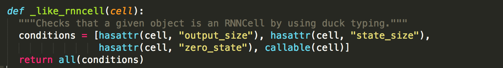

上图是TensorFlow中rnn实现的一个源码。它定义了一个_like_rnncell方法和一些属性。每一个RNNCell都必须具有以上属性，并使用call方法实现:`(output,state)=call(input,state)`

既然传统RNN存在这么多问题，那么后来者做了哪些改进呢？下面LSTM对传统RNN的改进，主要解决的是gradient问题和conflict问题。

为了克服误差消失的问题，需要做一些限制，先假设仅仅只有一个神经元与自己连接，简图如下：

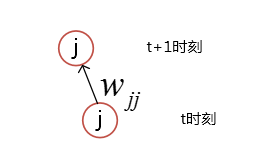

 t时刻的误差信号计算如下（Sepp H.,1998）：

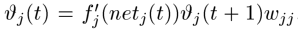

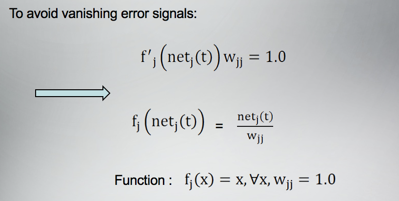

上图第一个式子表示为了使误差不产生变化，强制令其为1，第二个式子表示激活函数是线性的，为了避免梯度消失，我们在t时刻求得的$$w_{\text{jj}}$$是1.0 ，可以推出对于任意x,使得上式成立的条件是$$f_{j(x)} = x,w_{\text{jj }}$$=1.0.这样我们就获得了CEC(constant error carrousel)，即常量误差流单元。

以下两点可以保证误差可以无损的传递到t-1时刻

（1）矩阵$$w_{\text{hh}}$$简化为对角矩阵：仅允许矩阵自旋，不允许其他节点链接到本节点

（2）Sigmoid替换为线性函数

在计算CEC输出的时候，把结果又乘以了output输出，下图中的小圆圈代表CEC,y=x的直线代表神经元激活是线性的，且权重为1。

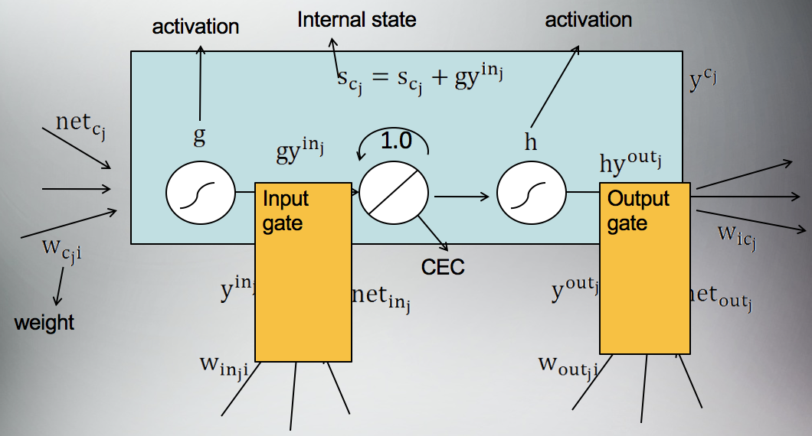

上面是第一个问题，对于第二个问题也就是conflict问题是如何解决的呢？conflict问题也就是输入层到隐藏层，以及隐藏层到输出层无法确定通过量如何，原始RNN引入两个gate，input gate 和output gate。input gate 控制某些输入能够进入cell当中。通过权重控制输入或屏蔽存储的输入，以保持cell信息不变（调节进入到cell到里面的输入）。同理output gate通过权重调节隐藏层到输出层的输出，控制cell的信息对外输出产生多大的影响。

为什么要这么做？

DNN隐藏层到输出层由$$w_{\text{kj}}$$控制（k很早之前叫隐藏层）。对于DNN所有输出$$w_{\text{kj}}$$都是一样的，这对传统的DNN模型没有问题，因为DNN不需要考虑历史的信息。但是在RNN中，如果推断出我能讲法语，需要存储“我出生在法国”中“法国”这个重要信息。由于历史信息对当前输出有影响，传统DNN固定隐藏层到输出层权重没有问题，但是对于RNN必须要一个可以学习的output gate，这个权重能够对输入层到输出层的信息进行一个调节。这就是origial RNN的一个架构。总结一下，即是在origial RNN加入两个gate（主线），一个对输入信息有一个影响，一个对输出信息有一个影响，加上CEC是对中间传递信息有一个影响。

这是RNN到LSTM的第一个演进，这种演进也会存在一些问题，接下来就是标准LSTM。

三、标准LSTM
============

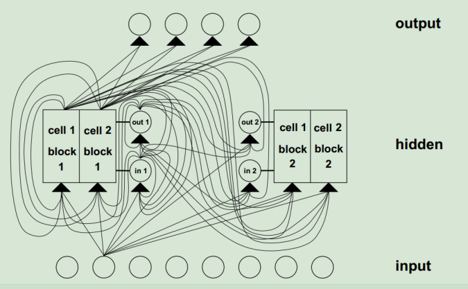

大家看到这么错综复杂的原因是，对每一个时刻进入block的信息有来自输出层的输入和来自上一个神经元的输出。这只是输入的信息，包括Input本身输入的信息和上一个神经元输出的信息，这是他们之间传递的数据流的一个关系。

下面我们进入到标准的LSTM。原始RNN随着时间序列增加，LSTM网络本身没有重置的机制，如果两句话合并为一句话作为输入的话，希望合并后将第一句话进行reset。为什么呢？因为第二句话说的话可能和第一句话毫无关系，我们希望RNN忘记第一句话。LSTM就是希望有这种记忆的功能。但是传统LSTM没有这种功能，导致cell state发生饱和，一旦饱和后，输出的梯度很小，sigmoid函数曲线当x增大时梯度趋于0，从而阻碍error的输入

另一个问题是输入的梯度趋近于1，整个输出层数输出近似于输出门的输出，意味着网络丧失了memory功能。

标准LSTM相对于原始LSTM做了一下几点改进：

1.  增加了忘记门；

2.  激活函数改为sigmoid或双曲正切函数；

3.  CEC权重改为有忘记门的激活函数。

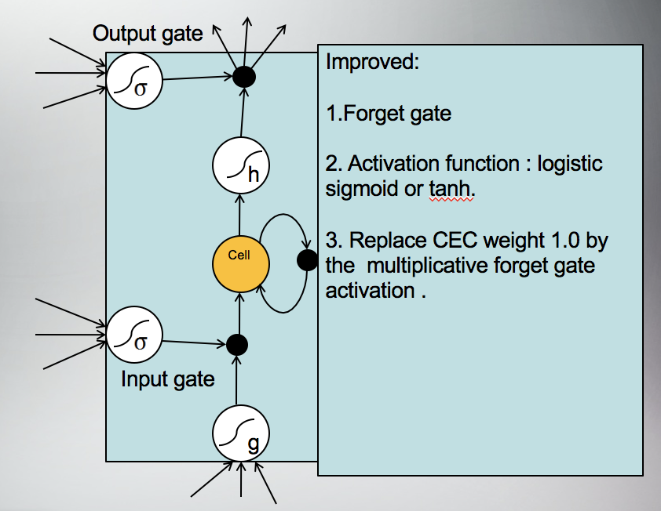

从上面可以看到，标准LSTM相比于原始LSTM引入了忘记门，可以学习什么时候应该reset。

1.LSTM第一个变体：LSTM + peepholes
--------------------------------

标准LSTM存在的问题是：LSTM output
gate权重接近于0的话，网络的下一时刻就会丢掉历史信息，如何解决这个问题？LSTM的第一个变体增加了CEC到各个gate的连线，使得CEC既会受到当前gate影响，也会影响下一时刻的gate，peepholes就是下图中三条虚线，将上一时刻的状态值也作为输入。

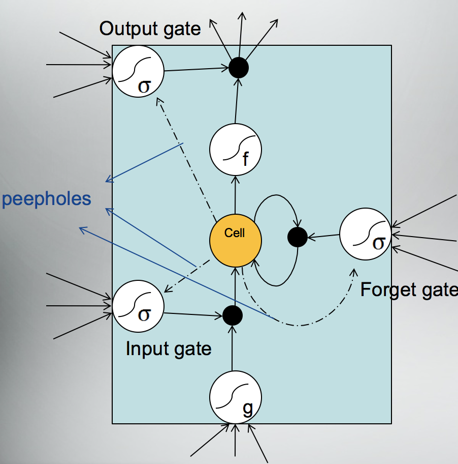 

Tensorflow中对于LSTM的实现（注：Basic lstm 指的是没有forget gate的LSTM，LSTM指的是加了forget gate和CEC）包括Block RNNCells和Fused。其中带block的cell是单一的算子，粒度比较细，经过了很好地优化，运行速度比较快，兼容了权重矩阵和偏置矩阵。而不带block的cell是多个算子的融合。

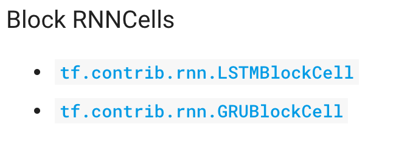

另外一个tensorflow对RNNcell的实现是fused RNNcell,即融合的RNNcell,表示在时间维度上扩展整个的RNN 序列。

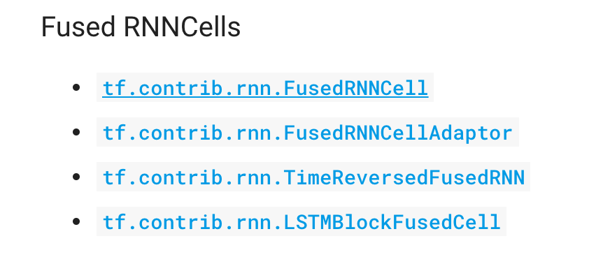

2.LSTM第二个变体：completed forget and output gate
--------------------------------------------------

LSTM第二个变体是把忘记门和输出门组合在一起，替代原来的忘记门的功能以及输出门要输出的新信息给下一个信息。

3.LSTM第三个变体：GRU
---------------------

第三个演进是大家非常熟悉的GRU，是一个简化的LSTM，既没有窥视孔的连接，也没有加入output激活函数，它是将input gate与forget gate给couple起来称作update gate，将output gate称作reset gate.优点是在设备上速度更快，兼容性更好。

以上是说的LSTM的三个变体。

tensorflow的RNN的API主要集中在tensorflow\\python\\ops目录下的rnn和rnn_cell两个模块，其中rnn模块提供了一些helper方法，rnn_cell模块定义了常见的RNN cells,包括RNN以及优化LSTM和GRU等等。

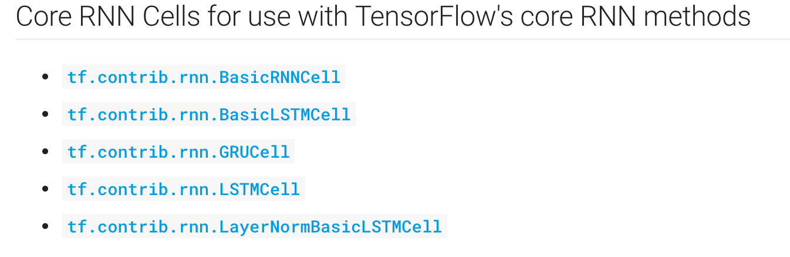

那么我们如何创建一个基础的RNN呢？首先引入RNN模块,下面是python代码：

>   `from TensorFlow.contrib.rnn import rnn_cell`

>   `cell = rnn_cell.BasicRNNCell(input,state)`

如何创建一个LSTM或者GRU的cell?

>   `cell= rnn_cell.BasicLSTMCell(num_units)\#最最基础的，不带peeholes的`

>   `cell = rnn_cell.LSTMCell(num_units,input_size)\#可以设置peehole等属性`

>   `cell=rnn_cell.GRUCell(num_units)`

如何调用呢？

>   `Output,state=cell(input,state)`

四、智能聊天机器人的TensorFlow实现
==================================

智能聊天机器人的实现方式一般有两种，一种是基于检索式的实现方式，另一种是基于生成式的实现方式。

基于检索式的实现方式具体是怎样的呢？首先把query输入进来进行检索，得到问答句对，这时需要mapping,找出和query最匹配的问答句对，并且对最匹配的问答句对做一个排序，找出和问句相关性最高的，去把它输出。这是基于检索的模型的在线的模式。它的离线部分需要训练，首先需要一个庞大的数据库来存储一系列问句和答句的语句对，然后需要一些算法来learning to match，去学习一个匹配规则，同时还需要做一个工作，去学习如何去排序，找出一堆和query匹配的问答句对。它的优势是什么呢？首先第一个是他的答句的可读性好，因为我们的问答句是存在数据库中，数据库都是人类的语言，答句是可以读懂的。这是相对于生成式聊天机器人的。第二是多样性强，相同的问题可以有不同的答句，此外，如果出现不相关的答句，非常容易分析是哪个模块。劣势是需要对候选的结果做排序。生成式聊天机器人的优势是实现过程是端到端的序列比较容易实现，其次是它避免了很大的数据集，并且它不需要对每一个模块调优，避免了各个模块之间误差的级联效应。劣势是很难保证每一个生成的结果是可读的。

如果我们要实现一个聊天机器人，该如何评价它的好坏呢？评价好坏最重要的一个方式是问句和答句的相关性，相关性本质上是短文本相关性计算。相关方法很多，这里举一些常见的相关度计算，比如基于机器翻译的相关度计算，基于主题模型的LDA的相似度计算。我们期望实现的聊天机器人的目标，是希望其能够对不同的提问给出合适的回答，还能考虑到人类的个体性差异。比如男生女生问同一个问题，希望聊天机器人也能给出不同的回答。目前最火热的聊天机器人是基于seq2seq

+attention的模型。seq2seq模型是一个翻译模型，主要是把一个序列翻译成另一个序列，用两个RNNLM，一个作为编码器，另一个作为解码器，组成RNN编码器-解码器。

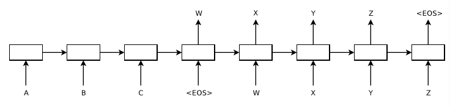

(Sutskever et al.，2014)

这里将ABC作为输入，映射成WXYZ的输出，编码器对ABC进行编码，生成中间语义C，解码器对中间语义C进行解码，然后在输出的每一个时刻，结合生成的WXYZ生成Z,但是这个框架有个缺点，在生成decoder的时候，生成句子的每一个词，采用的中间语义C都是相同的，所以当句子比较短的时候，我们生成的答句还比较贴切，当句子比较长时，就不合语义了。这时我们引入attention，是说将生成的中间语义C，给原语句一个权重，比如C1,C2,C3，我们在生成语句的时候，问句的每个词对答句的每个词影响是不一样的，这就是attention的机制。

下面我们看一下聊天机器人的具体实现。数据集是康奈尔大学的电影对白语料库。

首先需要对数据集做预处理，我们将问句和答句分开。然后创建词汇表，词汇表中文件大概有两万多词汇，里面用不同的标识代表一个句子的开始结束等。接着转化为ids文件，即文件中每一行有一对问答句，并且有一个ID（作者进行了417次迭代，可以回答一些简单的问句，在这里作者未提供代码。）GIthub上有佟达老师实现过的源代码以及本人实践的一个demo,感兴趣可以看一下，地址分别是https://github.com//tongda//windbag和https://github.com/zoneplus/chatbot_practice

Reference

Sutskever I, Vinyals O, Le Q V. Sequence to sequence learning with neural networks[J]. 2014, 4:3104-3112.

Sepp Hochreiter. The Vanishing Gradient Problem During Learning Recurrent  Neural Nets, and Problem Solutions[J]. International Journal of Uncertainty, Fuzziness and Knowledge-Based Systems, 1998, 6(02):-.

http://colah.github.io/posts/2015-08-Understanding-LSTMs/

