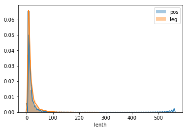
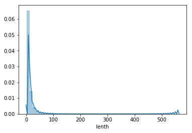
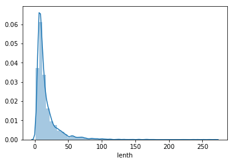
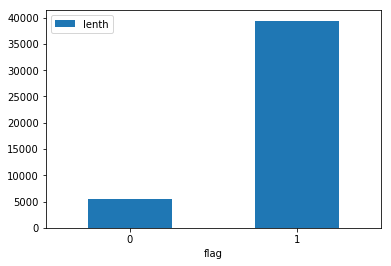
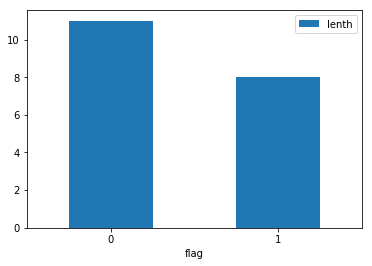
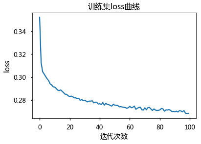

## 情感分析

简述：一直想拿LSTM练练文本分类，于是有了此文

- 数据来源及描述：不知道什么时候搜集到的关于美的热水器评价数据集（电商领域）,其中约3.9W条情感倾向正例样本，6000条情感倾向负例样本

- 基本思路：
    
    1、首先查看数据分布，利用matplotlib可视化句子词数分布情况；
    
    2、利用jieba分词工具，完成分词、清理停用词等操作；
    
    3、利用gensim中Word2vec工具，完成词向量转换工作，并简要介绍word2vec语义近似功能（这里的语义近似并非语文学科中的近义词概念，而是在词向量空间中计算出余弦夹角近似）；
    
    4、为了能顺利进入LSTM模型，使用词数中位数作为截断依据，让序列长度保持一致；
    
    5、将处理好的数据导入LSTM模型中迭代100次，观察LOSS变化情况，并预测其情感倾向分类,最终计算大约有89.12%准确率，证明效果还不错

- 参考文章：
    
    参考文章推荐两篇，一篇偏重理论，一篇偏重实践
    
    1、想看LSTM公式推导的小伙伴们看这篇<a href="http://blog.csdn.net/u010754290/article/details/47167979">LSTM公式推导</a>  。这篇文档描述LSTM模型我觉得是目前看起来公式写的最清晰，图画得最明白的一篇，想要彻底吃透LSTM，把这个博客中的公式跟着推一遍，应该会有很大收获；
    
    2、实践的话，我参考这篇文章<a href="http://blog.csdn.net/churximi/article/details/61210129">LSTM+词向量文本分类</a>  结合自己的理解，完成了此篇LSTM情感分析工作

### 依赖环境：

- 系统环境： win7环境（linux mac应该也能运行）

- python3

- keras(backend: Tensorflow)

- pandas

- jieba

- gensim

- re

### 引入相关库


```python
import keras
import pandas as pd 
import jieba
from keras.preprocessing import sequence
from keras.optimizers import SGD, RMSprop, Adagrad
from keras.utils import np_utils
from keras.models import Sequential
from keras.layers.core import Dense, Dropout, Activation
from keras.layers.embeddings import Embedding
from keras.layers.recurrent import LSTM, GRU
import gensim
import re
```

    Using TensorFlow backend.
    d:\Anaconda3\lib\site-packages\gensim\utils.py:860: UserWarning: detected Windows; aliasing chunkize to chunkize_serial
      warnings.warn("detected Windows; aliasing chunkize to chunkize_serial")
    

### 1、读入数据


```python
data_neg = pd.read_csv('./input/meidi_jd_neg.txt',header=-1)
data_neg['flag']=0
data_neg.columns=['words','flag']
```

#### 情感倾向为负的评论


```python
data_neg.head(5)
```


<div>
<style>
    .dataframe thead tr:only-child th {
        text-align: right;
    }

    .dataframe thead th {
        text-align: left;
    }

    .dataframe tbody tr th {
        vertical-align: top;
    }
</style>
<table border="1" class="dataframe">
  <thead>
    <tr style="text-align: right;">
      <th></th>
      <th>words</th>
      <th>flag</th>
    </tr>
  </thead>
  <tbody>
    <tr>
      <th>0</th>
      <td>好像遥控是坏的 还是送的电池没有电 算了 热水器上将就着按吧</td>
      <td>0</td>
    </tr>
    <tr>
      <th>1</th>
      <td>要打十个字才能发 我就打十个字</td>
      <td>0</td>
    </tr>
    <tr>
      <th>2</th>
      <td>调温的开关太紧了 不知道是不是都这样 送货和安装的师傅来的很准时 不像以前要等老半天</td>
      <td>0</td>
    </tr>
    <tr>
      <th>3</th>
      <td>上面安装既然花了我差不多*块 但是这热水器马马虎虎吧</td>
      <td>0</td>
    </tr>
    <tr>
      <th>4</th>
      <td>这东西有不是什么高科技 比别的厂家还贵 想不明白</td>
      <td>0</td>
    </tr>
  </tbody>
</table>
</div>


#### 情感倾向为正的评论


```python
data_pos = pd.read_csv('./input/meidi_jd_pos.txt',header=-1)
data_pos['flag']=1
data_pos.columns =['words','flag']
data_pos.head(5)
```


<div>
<style>
    .dataframe thead tr:only-child th {
        text-align: right;
    }

    .dataframe thead th {
        text-align: left;
    }

    .dataframe tbody tr th {
        vertical-align: top;
    }
</style>
<table border="1" class="dataframe">
  <thead>
    <tr style="text-align: right;">
      <th></th>
      <th>words</th>
      <th>flag</th>
    </tr>
  </thead>
  <tbody>
    <tr>
      <th>0</th>
      <td>还好 安装费有点贵</td>
      <td>1</td>
    </tr>
    <tr>
      <th>1</th>
      <td>商品已经收到 打开包装检查一下外观完美；还没有安装使用 用后再评论</td>
      <td>1</td>
    </tr>
    <tr>
      <th>2</th>
      <td>东西不错 租房子用的 足够了</td>
      <td>1</td>
    </tr>
    <tr>
      <th>3</th>
      <td>很好 今天安装好了 非常满意</td>
      <td>1</td>
    </tr>
    <tr>
      <th>4</th>
      <td>可以把 能用就好 出租的</td>
      <td>1</td>
    </tr>
  </tbody>
</table>
</div>


#### 读入停用词


```python
stop = pd.read_csv('./input/stoplist.txt',sep='timp',encoding='utf8')
```

    d:\Anaconda3\lib\site-packages\ipykernel\__main__.py:1: ParserWarning: Falling back to the 'python' engine because the 'c' engine does not support regex separators (separators > 1 char and different from '\s+' are interpreted as regex); you can avoid this warning by specifying engine='python'.
      if __name__ == '__main__':
    


```python
stop_list = list(stop.iloc[:,0])
```

#### 记录标点符号集合，将标点符号也作为停用词中一部分


```python
import string
desl =string.punctuation
desl = desl+"、（）"
```

#### 将正负例数据拼接在一起


```python
data_combine = pd.concat([data_neg,data_pos],axis=0)
```

#### 利用正则表达式替换标点符号, 不明白正则表达式的请移步<a href="http://www.runoob.com/python/python-reg-expressions.html">正则表达式链接</a>  ，在这里只需要明白re.sub命令即可


```python
data_combine['words_punc'] = data_combine['words'].apply(lambda s :  re.sub(r'[%s]+'%desl,"",s))
```


```python
data_combine['words_cuts'] = data_combine['words_punc'].apply(lambda s : list(jieba.cut(s))) 
```

    Building prefix dict from the default dictionary ...
    Loading model from cache C:\Users\Lenovo\AppData\Local\Temp\jieba.cache
    Loading model cost 1.182 seconds.
    Prefix dict has been built succesfully.
    

#### 去除停用词


```python
data_combine['words_cuts_stop'] = data_combine['words_cuts'].apply(lambda s : [ i for i in s if i not in stop_list+[","," "]])
```


```python
data_combine.head(2)
```


<div>
<style>
    .dataframe thead tr:only-child th {
        text-align: right;
    }

    .dataframe thead th {
        text-align: left;
    }

    .dataframe tbody tr th {
        vertical-align: top;
    }
</style>
<table border="1" class="dataframe">
  <thead>
    <tr style="text-align: right;">
      <th></th>
      <th>words</th>
      <th>flag</th>
      <th>words_punc</th>
      <th>words_cuts</th>
      <th>words_cuts_stop</th>
    </tr>
  </thead>
  <tbody>
    <tr>
      <th>0</th>
      <td>好像遥控是坏的 还是送的电池没有电 算了 热水器上将就着按吧</td>
      <td>0</td>
      <td>好像遥控是坏的 还是送的电池没有电 算了 热水器上将就着按吧</td>
      <td>[好像, 遥控, 是, 坏, 的,  , 还是, 送, 的, 电池, 没有, 电,  , 算...</td>
      <td>[好像, 遥控, 是, 坏, 还是, 送, 电池, 没有, 电, 算了, 热水器, 上将, ...</td>
    </tr>
    <tr>
      <th>1</th>
      <td>要打十个字才能发 我就打十个字</td>
      <td>0</td>
      <td>要打十个字才能发 我就打十个字</td>
      <td>[要, 打, 十个, 字, 才能, 发,  , 我, 就, 打, 十个, 字]</td>
      <td>[要, 打, 十个, 字, 才能, 发, 我, 就, 打, 十个, 字]</td>
    </tr>
  </tbody>
</table>
</div>


### 数据探索


```python
import seaborn as sns
import matplotlib.pyplot as plt 
```


```python
data_combine['lenth'] = data_combine['words_cuts_stop'].apply(lambda s:len(s))
```


```python
%matplotlib inline
```

#### 绘制正向、负向语言分布词数分布情况


```python
plt.figure(figsize=(6,4))
sns.distplot(data_combine[data_combine['flag']==1]['lenth'],label='pos')
sns.distplot(data_combine[data_combine['flag']==0]['lenth'],label='neg')
plt.legend(['pos','leg'])
```


    <matplotlib.legend.Legend at 0x19a07400>





```python
sns.distplot(data_combine[data_combine['flag']==1]['lenth'],label='pos')
```


    <matplotlib.axes._subplots.AxesSubplot at 0x1b2e7978>





```python
sns.distplot(data_combine[data_combine['flag']==0]['lenth'],label='neg')
```


    <matplotlib.axes._subplots.AxesSubplot at 0x1b4000b8>





#### 正负向语料比例情况


```python
data_combine.pivot_table(index='flag',aggfunc={'lenth':'count'}).plot(kind='bar')
plt.xticks(rotation=0)
```


    (array([0, 1]), <a list of 2 Text xticklabel objects>)





#### 情感倾向正负向语料长度中位数分布情况，看起来评价负面的话比较多  嗯嗯呃


```python
data_combine.pivot_table(index='flag',aggfunc={'lenth':'median'}).plot(kind='bar')
plt.xticks(rotation=0)
```


    (array([0, 1]), <a list of 2 Text xticklabel objects>)





### 制作词云


```python
from wordcloud import WordCloud
```


```python
data_combine.head(2)
```


<div>
<style>
    .dataframe thead tr:only-child th {
        text-align: right;
    }

    .dataframe thead th {
        text-align: left;
    }

    .dataframe tbody tr th {
        vertical-align: top;
    }
</style>
<table border="1" class="dataframe">
  <thead>
    <tr style="text-align: right;">
      <th></th>
      <th>words</th>
      <th>flag</th>
      <th>words_punc</th>
      <th>words_cuts</th>
      <th>words_cuts_stop</th>
      <th>lenth</th>
    </tr>
  </thead>
  <tbody>
    <tr>
      <th>0</th>
      <td>好像遥控是坏的 还是送的电池没有电 算了 热水器上将就着按吧</td>
      <td>0</td>
      <td>好像遥控是坏的 还是送的电池没有电 算了 热水器上将就着按吧</td>
      <td>[好像, 遥控, 是, 坏, 的,  , 还是, 送, 的, 电池, 没有, 电,  , 算...</td>
      <td>[好像, 遥控, 是, 坏, 还是, 送, 电池, 没有, 电, 算了, 热水器, 上将, ...</td>
      <td>16</td>
    </tr>
    <tr>
      <th>1</th>
      <td>要打十个字才能发 我就打十个字</td>
      <td>0</td>
      <td>要打十个字才能发 我就打十个字</td>
      <td>[要, 打, 十个, 字, 才能, 发,  , 我, 就, 打, 十个, 字]</td>
      <td>[要, 打, 十个, 字, 才能, 发, 我, 就, 打, 十个, 字]</td>
      <td>11</td>
    </tr>
  </tbody>
</table>
</div>


```python
data_combine['space_words'] = data_combine['words_cuts_stop'].apply(lambda s : ' '.join(s))
```

#### 为了解决乱码问题，指定字体文件，字体文件，搜索微软雅黑字体，需要大家自行下载，放在指定目录下，这里放在C:\Windows\fonts2 下了


```python
font = r'C:\Windows\fonts2\msyh.ttf'
```

##### 情感评论为负面的评价 大家主要在说些什么


```python
cloud = WordCloud(width=1240, font_path=font,height=880).generate((' '.join(data_combine[data_combine['flag']==0]['space_words'])))
plt.figure(figsize=(20, 15))
plt.imshow(cloud)
plt.axis('off')
```


    (-0.5, 1239.5, 879.5, -0.5)


##### 评价为正面的伙伴们在说些什么


```python
cloud = WordCloud(width=1240, font_path=font,height=880).generate((' '.join(data_combine[data_combine['flag']==1]['space_words'])))
plt.figure(figsize=(20, 15))
plt.imshow(cloud)
plt.axis('off')
```


    (-0.5, 1239.5, 879.5, -0.5)


### Word2vec


```python
from gensim.models import Word2Vec
```

#### Word2vec初步使用 ，这里设定最小次数为3才纳入词典，最后输出词向量维度为60，这些参数可以自行根据情况调整


```python
emotion_w2v = Word2Vec(data_combine['words_cuts_stop'],min_count=3,size=60)
```

#### 热水器 在语义空间上与各个词之间的相似性


```python
emotion_w2v.most_similar(u'热水器')
```


    [('机器', 0.5852192640304565),
     ('机子', 0.5446995496749878),
     ('东西', 0.49695444107055664),
     ('一档', 0.49490752816200256),
     ('觉得', 0.4857451319694519),
     ('奇怪的是', 0.4810256063938141),
     ('狭窄', 0.47884035110473633),
     ('对得起', 0.4785222113132477),
     ('这价', 0.4693329632282257),
     ('款', 0.4662902355194092)]


```python
emotion_w2v.similarity(u'热水器',u'办公室')
```


    0.45923745472791311


###  进入模型前的数据预处理


```python
from sklearn.cross_validation import  train_test_split
```

    d:\Anaconda3\lib\site-packages\sklearn\cross_validation.py:44: DeprecationWarning: This module was deprecated in version 0.18 in favor of the model_selection module into which all the refactored classes and functions are moved. Also note that the interface of the new CV iterators are different from that of this module. This module will be removed in 0.20.
      "This module will be removed in 0.20.", DeprecationWarning)
    


```python
data_combine.lenth.describe()
```


    count    44865.000000
    mean        13.137635
    std         16.481689
    min          1.000000
    25%          6.000000
    50%          8.000000
    75%         14.000000
    max        562.000000
    Name: lenth, dtype: float64


#### 为了避免太多字符串为空，确定字符串长度为16（依据: 大概80%分位数吧）


```python
data_combine.head(2)
```


<div>
<style>
    .dataframe thead tr:only-child th {
        text-align: right;
    }

    .dataframe thead th {
        text-align: left;
    }

    .dataframe tbody tr th {
        vertical-align: top;
    }
</style>
<table border="1" class="dataframe">
  <thead>
    <tr style="text-align: right;">
      <th></th>
      <th>words</th>
      <th>flag</th>
      <th>words_punc</th>
      <th>words_cuts</th>
      <th>words_cuts_stop</th>
      <th>lenth</th>
      <th>space_words</th>
    </tr>
  </thead>
  <tbody>
    <tr>
      <th>0</th>
      <td>好像遥控是坏的 还是送的电池没有电 算了 热水器上将就着按吧</td>
      <td>0</td>
      <td>好像遥控是坏的 还是送的电池没有电 算了 热水器上将就着按吧</td>
      <td>[好像, 遥控, 是, 坏, 的,  , 还是, 送, 的, 电池, 没有, 电,  , 算...</td>
      <td>[好像, 遥控, 是, 坏, 还是, 送, 电池, 没有, 电, 算了, 热水器, 上将, ...</td>
      <td>16</td>
      <td>好像 遥控 是 坏 还是 送 电池 没有 电 算了 热水器 上将 就 着 按 吧</td>
    </tr>
    <tr>
      <th>1</th>
      <td>要打十个字才能发 我就打十个字</td>
      <td>0</td>
      <td>要打十个字才能发 我就打十个字</td>
      <td>[要, 打, 十个, 字, 才能, 发,  , 我, 就, 打, 十个, 字]</td>
      <td>[要, 打, 十个, 字, 才能, 发, 我, 就, 打, 十个, 字]</td>
      <td>11</td>
      <td>要 打 十个 字 才能 发 我 就 打 十个 字</td>
    </tr>
  </tbody>
</table>
</div>


```python
def return_w2v_value(s):
    try :
        return emotion_w2v[s]
    except:
        return [0]*60
def modify_words_lenth(s):
    if len(s)<=16:
        return s +['         ']*(16-len(s))
    else:
        return s[:16]
```

####  不足16个词的先补齐16个词，超过16个词的截取16个词
#### 把截取后的词按照训练好的w2v词向量转换


```python
data_combine['words_cuts_stop_modify'] = data_combine['words_cuts_stop'].apply(lambda s : modify_words_lenth(s))
data_combine['words_trans_w2v'] = data_combine['words_cuts_stop_modify'].apply(lambda s : [return_w2v_value(i) for i in s])
```


```python
data_combine.head(2)
```


<div>
<style>
    .dataframe thead tr:only-child th {
        text-align: right;
    }

    .dataframe thead th {
        text-align: left;
    }

    .dataframe tbody tr th {
        vertical-align: top;
    }
</style>
<table border="1" class="dataframe">
  <thead>
    <tr style="text-align: right;">
      <th></th>
      <th>words</th>
      <th>flag</th>
      <th>words_punc</th>
      <th>words_cuts</th>
      <th>words_cuts_stop</th>
      <th>lenth</th>
      <th>space_words</th>
      <th>words_cuts_stop_modify</th>
      <th>words_trans_w2v</th>
    </tr>
  </thead>
  <tbody>
    <tr>
      <th>0</th>
      <td>好像遥控是坏的 还是送的电池没有电 算了 热水器上将就着按吧</td>
      <td>0</td>
      <td>好像遥控是坏的 还是送的电池没有电 算了 热水器上将就着按吧</td>
      <td>[好像, 遥控, 是, 坏, 的,  , 还是, 送, 的, 电池, 没有, 电,  , 算...</td>
      <td>[好像, 遥控, 是, 坏, 还是, 送, 电池, 没有, 电, 算了, 热水器, 上将, ...</td>
      <td>16</td>
      <td>好像 遥控 是 坏 还是 送 电池 没有 电 算了 热水器 上将 就 着 按 吧</td>
      <td>[好像, 遥控, 是, 坏, 还是, 送, 电池, 没有, 电, 算了, 热水器, 上将, ...</td>
      <td>[[0.116414, 0.620244, -0.984428, -0.027382, 0....</td>
    </tr>
    <tr>
      <th>1</th>
      <td>要打十个字才能发 我就打十个字</td>
      <td>0</td>
      <td>要打十个字才能发 我就打十个字</td>
      <td>[要, 打, 十个, 字, 才能, 发,  , 我, 就, 打, 十个, 字]</td>
      <td>[要, 打, 十个, 字, 才能, 发, 我, 就, 打, 十个, 字]</td>
      <td>11</td>
      <td>要 打 十个 字 才能 发 我 就 打 十个 字</td>
      <td>[要, 打, 十个, 字, 才能, 发, 我, 就, 打, 十个, 字,          ...</td>
      <td>[[0.345645, 2.26546, -1.03312, -0.443616, 1.51...</td>
    </tr>
  </tbody>
</table>
</div>


### 分割数据集


```python
x_train,x_test,y_train,y_test = train_test_split(data_combine['words_trans_w2v'],data_combine['flag'],test_size=0.2)
```


```python
import numpy as np 
```

#### 这里需要将特征数据x转换成  N× L×M 维度， 其中N 代表语句个数，L代表每句话长度，M代表每句话中每个词对应的词向量长度，目标数据y 转换成 N× class维度，其中N代表语句个数， class代表分类个数，这里情感分析只有两类 ，所以取2


```python
x_train_modify = np.array(list(x_train))
```


```python
x_test_modify = np.array(list(x_test))
```


```python
y_train_modify = np.array(pd.get_dummies(y_train))
y_test_modify = np.array(pd.get_dummies(y_test))
```


```python
x_train_modify.shape, x_test_modify.shape, y_train_modify.shape , y_test_modify.shape
```


    ((35892, 16, 60), (8973, 16, 60), (35892, 2), (8973, 2))


```python
x_train_modify.shape
```


    (35892, 16, 60)


#### 建立模型训练。。。。。耗时可能比较长，如果需要快速查看效果  可以将nb_epoch参数修改小一点


```python
model = Sequential()
model.add(LSTM(22, input_shape=(16,60),dropout=0.5,activation='sigmoid'))
model.add(Dense(2, activation='softmax'))
model.compile(loss='categorical_crossentropy', optimizer='adam', metrics=['accuracy'])
print(model.summary())
print('Fit Model..')
```
#  神经网络训练
```
history = model.fit(x_train_modify,y_train_modify,batch_size=64,nb_epoch=100)
```

    _________________________________________________________________
    Layer (type)                 Output Shape              Param #   
    =================================================================
    lstm_21 (LSTM)               (None, 22)                7304      
    _________________________________________________________________
    dense_22 (Dense)             (None, 2)                 46        
    =================================================================
    Total params: 7,350
    Trainable params: 7,350
    Non-trainable params: 0
    _________________________________________________________________
    None
    Fit Model..
    

    d:\Anaconda3\lib\site-packages\keras\models.py:848: UserWarning: The `nb_epoch` argument in `fit` has been renamed `epochs`.
      warnings.warn('The `nb_epoch` argument in `fit` '
    

    Epoch 1/100
    35892/35892 [==============================] - 12s - loss: 0.3521 - acc: 0.8783    
    Epoch 2/100
    35892/35892 [==============================] - 12s - loss: 0.3127 - acc: 0.8781    
    Epoch 3/100
    35892/35892 [==============================] - 11s - loss: 0.3048 - acc: 0.8786    
    Epoch 4/100
    35892/35892 [==============================] - 12s - loss: 0.3027 - acc: 0.8793    
    Epoch 5/100
    35892/35892 [==============================] - 12s - loss: 0.3006 - acc: 0.8818    
    Epoch 6/100
    35892/35892 [==============================] - 12s - loss: 0.2986 - acc: 0.8818    
    Epoch 7/100
    35892/35892 [==============================] - 12s - loss: 0.2970 - acc: 0.8820    
    Epoch 8/100
    35892/35892 [==============================] - 11s - loss: 0.2942 - acc: 0.8824    
    Epoch 9/100
    35892/35892 [==============================] - 11s - loss: 0.2932 - acc: 0.8832    
    Epoch 10/100
    35892/35892 [==============================] - 11s - loss: 0.2916 - acc: 0.8836    
    Epoch 11/100
    35892/35892 [==============================] - 11s - loss: 0.2914 - acc: 0.8850    
    Epoch 12/100
    35892/35892 [==============================] - 10s - loss: 0.2903 - acc: 0.8849    
    Epoch 13/100
    35892/35892 [==============================] - 11s - loss: 0.2888 - acc: 0.8850    
    Epoch 14/100
    35892/35892 [==============================] - 11s - loss: 0.2883 - acc: 0.8858    
    Epoch 15/100
    35892/35892 [==============================] - 11s - loss: 0.2890 - acc: 0.8852    
    Epoch 16/100
    35892/35892 [==============================] - 11s - loss: 0.2877 - acc: 0.8852    
    Epoch 17/100
    35892/35892 [==============================] - 11s - loss: 0.2865 - acc: 0.8854    
    Epoch 18/100
    35892/35892 [==============================] - 11s - loss: 0.2852 - acc: 0.8867    
    Epoch 19/100
    35892/35892 [==============================] - 11s - loss: 0.2851 - acc: 0.8857    
    Epoch 20/100
    35892/35892 [==============================] - 11s - loss: 0.2838 - acc: 0.8867    
    Epoch 21/100
    35892/35892 [==============================] - 12s - loss: 0.2832 - acc: 0.8876    
    Epoch 22/100
    35892/35892 [==============================] - 12s - loss: 0.2836 - acc: 0.8855    
    Epoch 23/100
    35892/35892 [==============================] - 11s - loss: 0.2830 - acc: 0.8874    
    Epoch 24/100
    35892/35892 [==============================] - 11s - loss: 0.2821 - acc: 0.8876    
    Epoch 25/100
    35892/35892 [==============================] - 11s - loss: 0.2820 - acc: 0.8863    
    Epoch 26/100
    35892/35892 [==============================] - 10s - loss: 0.2815 - acc: 0.8862    
    Epoch 27/100
    35892/35892 [==============================] - 11s - loss: 0.2817 - acc: 0.8872    
    Epoch 28/100
    35892/35892 [==============================] - 13s - loss: 0.2798 - acc: 0.8871    
    Epoch 29/100
    35892/35892 [==============================] - 12s - loss: 0.2806 - acc: 0.8873    
    Epoch 30/100
    35892/35892 [==============================] - 12s - loss: 0.2796 - acc: 0.8883    
    Epoch 31/100
    35892/35892 [==============================] - 13s - loss: 0.2800 - acc: 0.8882    
    Epoch 32/100
    35892/35892 [==============================] - 14s - loss: 0.2792 - acc: 0.8874    
    Epoch 33/100
    35892/35892 [==============================] - 13s - loss: 0.2785 - acc: 0.8878    
    Epoch 34/100
    35892/35892 [==============================] - 14s - loss: 0.2793 - acc: 0.8876    
    Epoch 35/100
    35892/35892 [==============================] - 13s - loss: 0.2792 - acc: 0.8889    
    Epoch 36/100
    35892/35892 [==============================] - 13s - loss: 0.2794 - acc: 0.8885    
    Epoch 37/100
    35892/35892 [==============================] - 13s - loss: 0.2777 - acc: 0.8888    
    Epoch 38/100
    35892/35892 [==============================] - 10s - loss: 0.2783 - acc: 0.8896    
    Epoch 39/100
    35892/35892 [==============================] - 10s - loss: 0.2782 - acc: 0.8886    
    Epoch 40/100
    35892/35892 [==============================] - 10s - loss: 0.2767 - acc: 0.8890    
    Epoch 41/100
    35892/35892 [==============================] - 10s - loss: 0.2770 - acc: 0.8895    
    Epoch 42/100
    35892/35892 [==============================] - 10s - loss: 0.2762 - acc: 0.8882    
    Epoch 43/100
    35892/35892 [==============================] - 11s - loss: 0.2779 - acc: 0.8878    
    Epoch 44/100
    35892/35892 [==============================] - 13s - loss: 0.2757 - acc: 0.8896    
    Epoch 45/100
    35892/35892 [==============================] - 13s - loss: 0.2773 - acc: 0.8887    
    Epoch 46/100
    35892/35892 [==============================] - 13s - loss: 0.2763 - acc: 0.8892    
    Epoch 47/100
    35892/35892 [==============================] - 13s - loss: 0.2762 - acc: 0.8896    
    Epoch 48/100
    35892/35892 [==============================] - 13s - loss: 0.2754 - acc: 0.8890    
    Epoch 49/100
    35892/35892 [==============================] - 16s - loss: 0.2749 - acc: 0.8896    
    Epoch 50/100
    35892/35892 [==============================] - 11s - loss: 0.2764 - acc: 0.8896    
    Epoch 51/100
    35892/35892 [==============================] - 11s - loss: 0.2757 - acc: 0.8892    
    Epoch 52/100
    35892/35892 [==============================] - 11s - loss: 0.2755 - acc: 0.8899    
    Epoch 53/100
    35892/35892 [==============================] - 11s - loss: 0.2754 - acc: 0.8890    
    Epoch 54/100
    35892/35892 [==============================] - 11s - loss: 0.2742 - acc: 0.8892    
    Epoch 55/100
    35892/35892 [==============================] - 10s - loss: 0.2745 - acc: 0.8890    
    Epoch 56/100
    35892/35892 [==============================] - 10s - loss: 0.2740 - acc: 0.8900    
    Epoch 57/100
    35892/35892 [==============================] - 10s - loss: 0.2738 - acc: 0.8911    
    Epoch 58/100
    35892/35892 [==============================] - 10s - loss: 0.2736 - acc: 0.8894    
    Epoch 59/100
    35892/35892 [==============================] - 10s - loss: 0.2729 - acc: 0.8891    
    Epoch 60/100
    35892/35892 [==============================] - 10s - loss: 0.2735 - acc: 0.8904    
    Epoch 61/100
    35892/35892 [==============================] - 11s - loss: 0.2747 - acc: 0.8886    
    Epoch 62/100
    35892/35892 [==============================] - 11s - loss: 0.2735 - acc: 0.8892    
    Epoch 63/100
    35892/35892 [==============================] - 11s - loss: 0.2738 - acc: 0.8899    
    Epoch 64/100
    35892/35892 [==============================] - 11s - loss: 0.2749 - acc: 0.8907    
    Epoch 65/100
    35892/35892 [==============================] - 12s - loss: 0.2721 - acc: 0.8909    
    Epoch 66/100
    35892/35892 [==============================] - 12s - loss: 0.2730 - acc: 0.8895    
    Epoch 67/100
    35892/35892 [==============================] - 13s - loss: 0.2737 - acc: 0.8904    
    Epoch 68/100
    35892/35892 [==============================] - 13s - loss: 0.2739 - acc: 0.8903    
    Epoch 69/100
    35892/35892 [==============================] - 13s - loss: 0.2717 - acc: 0.8889    
    Epoch 70/100
    35892/35892 [==============================] - 13s - loss: 0.2715 - acc: 0.8910    
    Epoch 71/100
    35892/35892 [==============================] - 13s - loss: 0.2734 - acc: 0.8903    
    Epoch 72/100
    35892/35892 [==============================] - 13s - loss: 0.2717 - acc: 0.8919    
    Epoch 73/100
    35892/35892 [==============================] - 13s - loss: 0.2735 - acc: 0.8900    
    Epoch 74/100
    35892/35892 [==============================] - 13s - loss: 0.2737 - acc: 0.8889    
    Epoch 75/100
    35892/35892 [==============================] - 13s - loss: 0.2724 - acc: 0.8905    
    Epoch 76/100
    35892/35892 [==============================] - 13s - loss: 0.2711 - acc: 0.8912    
    Epoch 77/100
    35892/35892 [==============================] - 14s - loss: 0.2724 - acc: 0.8916    
    Epoch 78/100
    35892/35892 [==============================] - 13s - loss: 0.2714 - acc: 0.8905    
    Epoch 79/100
    35892/35892 [==============================] - 13s - loss: 0.2711 - acc: 0.8913    
    Epoch 80/100
    35892/35892 [==============================] - 13s - loss: 0.2712 - acc: 0.8905    
    Epoch 81/100
    35892/35892 [==============================] - 13s - loss: 0.2716 - acc: 0.8913    
    Epoch 82/100
    35892/35892 [==============================] - 13s - loss: 0.2729 - acc: 0.8906    
    Epoch 83/100
    35892/35892 [==============================] - 13s - loss: 0.2725 - acc: 0.8910    
    Epoch 84/100
    35892/35892 [==============================] - 12s - loss: 0.2705 - acc: 0.8901    
    Epoch 85/100
    35892/35892 [==============================] - 12s - loss: 0.2716 - acc: 0.8899    
    Epoch 86/100
    35892/35892 [==============================] - 12s - loss: 0.2715 - acc: 0.8916    
    Epoch 87/100
    35892/35892 [==============================] - 12s - loss: 0.2719 - acc: 0.8905    
    Epoch 88/100
    35892/35892 [==============================] - 12s - loss: 0.2712 - acc: 0.8918    
    Epoch 89/100
    35892/35892 [==============================] - 12s - loss: 0.2701 - acc: 0.8913    
    Epoch 90/100
    35892/35892 [==============================] - 12s - loss: 0.2703 - acc: 0.8909    
    Epoch 91/100
    35892/35892 [==============================] - 12s - loss: 0.2700 - acc: 0.8908    
    Epoch 92/100
    35892/35892 [==============================] - 12s - loss: 0.2705 - acc: 0.8900    
    Epoch 93/100
    35892/35892 [==============================] - 12s - loss: 0.2697 - acc: 0.8914    
    Epoch 94/100
    35892/35892 [==============================] - 12s - loss: 0.2710 - acc: 0.8906    
    Epoch 95/100
    35892/35892 [==============================] - 12s - loss: 0.2706 - acc: 0.8918    
    Epoch 96/100
    35892/35892 [==============================] - 12s - loss: 0.2700 - acc: 0.8918    
    Epoch 97/100
    35892/35892 [==============================] - 12s - loss: 0.2710 - acc: 0.8896    
    Epoch 98/100
    35892/35892 [==============================] - 11s - loss: 0.2687 - acc: 0.8910    
    Epoch 99/100
    35892/35892 [==============================] - 11s - loss: 0.2684 - acc: 0.8916    
    Epoch 100/100
    35892/35892 [==============================] - 11s - loss: 0.2686 - acc: 0.8919    
    


```python
from matplotlib import pyplot
```


```python
import matplotlib as mpl
mpl.rcParams['font.sans-serif'] = ['Microsoft YaHei']#指定默认字体  
mpl.rcParams['axes.unicode_minus'] =False # 解决保存图像是负号'-'显示为方块的问题
#sns.axes_style()，可以看到是否成功设定字体为微软雅黑。

# 最后：修改seaborn中的一些设置
sns.set_context("talk")
```


```python
pyplot.plot(history.history['loss'], label='train')
plt.title(u'训练集loss曲线')
plt.xlabel(u'迭代次数')
plt.ylabel(u'loss')
# pyplot.plot(history.history['acc'], label='acc')
```


    <matplotlib.text.Text at 0x586ee128>





```python
from sklearn.metrics import  accuracy_score
```

### 计算预测结果


```python
prediction = [np.argmax(i) for i in model.predict(x_test_modify)]
```

### 计算精确率


```python
accuracy_score(prediction,y_test)
```


    0.89122924328541175


#### 结论：

- 最终精确率能达到89.12%，貌似比网上参考资料要高一些，或许word2vec比keras自带的embding方法效果会好些；

- 如果想要进一步提高准确度，词典制作，停用词词表可能还需要进一步整理，建立word2vec的时候，语句长度，输出维度参数可以进一步调参试试
